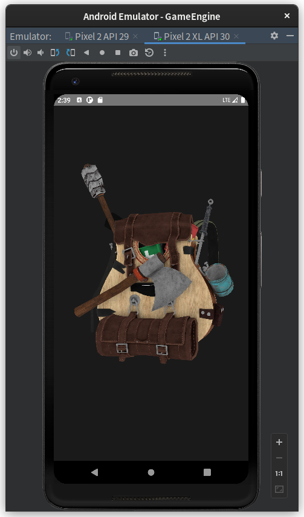

OpenGL Demo Android
=====

Based on OpenGL ES, [cglm](https://github.com/recp/cglm), [stb_image](https://github.com/nothings/stb/blob/master/stb_image.h)
and [Assimp](https://github.com/assimp/assimp).

> Still developing, and the main branch is currently not stable, might contain bugs.

Model: [backpack](https://sketchfab.com/3d-models/survival-guitar-backpack-low-poly-799f8c4511f84fab8c3f12887f7e6b36)

Things To Do
----

- [x] Render [OpenGL Demo](https://github.com/STARRY-S/OpenGL-Demo) by using OpenGL ES3.
- [ ] Camera movement, user interactive. (Still working...)
- [ ] Multi-platform (both Android and x86, x86_64, linux and windows). (Currently support Android, Linux)
- [x] Mesh and Texture importer. (Finished, might unstable, need test.)
- [ ] GUI tools. (Still Don't know how to do it)
- [ ] Sound, Physic, Network, etc...

Screenshot
----

Usage / Development
----

Just simply clone this repository, and open it by using Android Studio (latest version).
Then sync the project and compile it.

If you have any questions/ideas, create an issue/PR please, Chinese and English only.

LICENSE
----

> Apache-2.0
