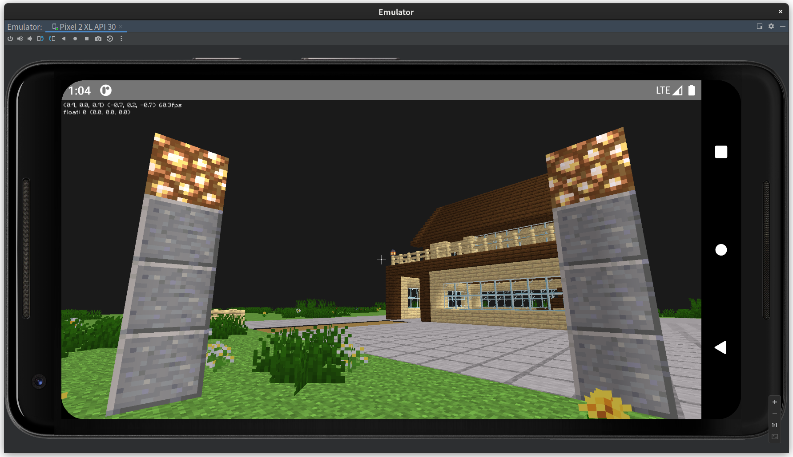

Aperture Engine - Android
=====

This is the Android implement of [Aperture](https://github.com/STARRY-S/Aperture)

> Still developing, currently ustable, might contain bugs.

Things To Do
----

The todo list of Aperture:
<https://github.com/STARRY-S/Aperture#current-status-todos>

Screenshot
----

Usage / Development
----

Just simply clone this repository, and open it by using Android Studio,
sync the project and build it.

If you have any questions, feel free to create any issue/PRs.

LICENSE
----

> Apache-2.0
